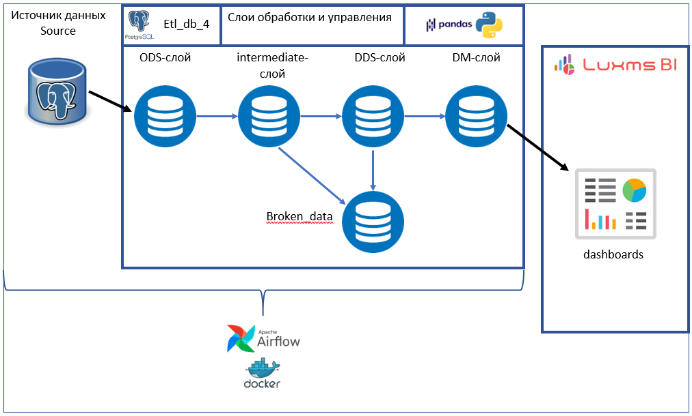

# Проект: Дашборд для отслеживания прогресса сотрудников

## Описание

Проект представляет собой оркестратор данных.

В приложения Docker поднят контейнер с Apache Airflow. Airflow обеспечивает оркестрацию ETL процесса. Обработка данных
происходит с помощью Python скриптов с использованием sql запросов и библиотеки pandas. Для визуализации используется
Luxms BI.

В директории dags находятся два скрипта:
1. init_schemes_and_tables.py: \
Отвечает за создание необходимых схем в базе данных и таблиц со связями. Данный скрипт запускается единожды
2. update_data.py: \
Скрипт реализует ETL процесс по миграции данных в созданных схемах. Данный скрипт автоматически запускается один раз в сутки

Схема реализуемой архитектуры:

### Установка и запуск

Клонирование репозитория:
git clone https://github.com/kfrsta/korus_team4
cd korus_team4

### Запуск сервисов с помощью Docker Compose:
Если вы используете windows предварительно необходимо установить Docker Desktop

Введите в терминале:

1. docker-compose up airflow-init

2. docker-compose up -d

### Доступ к Airflow:

Откройте браузер и перейдите по адресу http://localhost:8080
